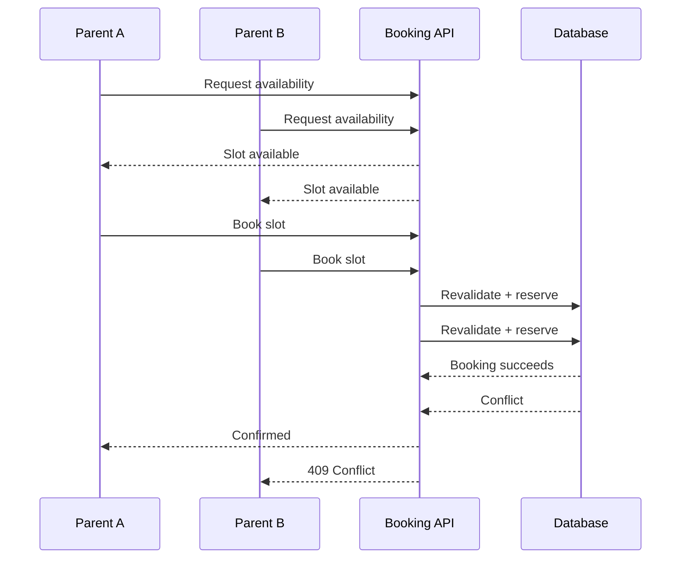
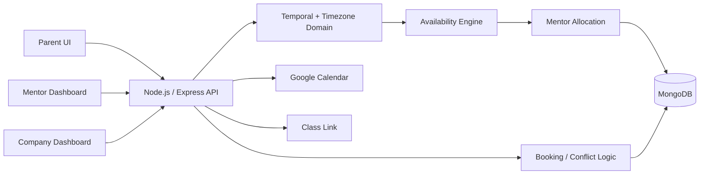

<div align="center">

<h1>Codeyoung Trial-Class Booking System</h1>

<p><strong>Timezone-aware · Mentor-aware · Concurrency-safe · Calendar-connected</strong></p>

<p>
  <a href="https://drive.google.com/file/d/1gv5-xCCyO4xnB1QaqRDJS8fqktmNCdE8/view?usp=drivesdk"><strong>▶ View Complete Prototype</strong></a>
</p>


</div>

---

## ⚡ What Makes This Project Different?

Most trial-class booking systems can be reduced to:

```text
Pick Date → Pick Time → Submit Form
```

This project treats scheduling as a **distributed time-and-resource problem**.

```text
                 PARENT
                   │
          "I want 10:00 AM"
                   │
                   ▼
        ┌─────────────────────┐
        │ Local Time + IANA TZ│
        └──────────┬──────────┘
                   │
                   ▼
             TEMPORAL
                   │
                   ▼
          **Exact Time Instant**
                   │
        ┌──────────┴──────────┐
        ▼                     ▼
 Parent Timezone        Mentor Timezone
        │                     │
        ▼                     ▼
   10:00 AM             2:30 PM IST
        │                     │
        └──────────┬──────────┘
                   ▼
          Availability Engine
                   │
                   ▼
        Eligible Mentor Pool
                   │
                   ▼
       **Automatic Mentor Allocation**
                   │
                   ▼
       **Transaction + Revalidation**
                   │
          ┌────────┴────────┐
          ▼                 ▼
       Confirmed          Conflict
          │
          ▼
 **Google Calendar + Class Link**
          │
          ▼
   **Mentor / Company Dashboard**
```

> **The parent chooses WHEN. The system chooses WHO. The database decides WHETHER the booking can safely exist.**

---

## 🧠 The Core Technical Idea

The hardest part of the system is not the calendar UI.

It is correctly converting:

**local human intent → timezone-aware date/time → exact instant → mentor availability → safe reservation**

The project uses the following temporal model:

```text
PlainDate + PlainTime
          +
     IANA Timezone
          │
          ▼
   ZonedDateTime
          │
          ▼
   Temporal.Instant
          │
          ▼
  Global appointment
          │
     ┌────┴────┐
     ▼         ▼
Parent view  Mentor view
```

For example:

```text
Parent
Europe/London
10:00 AM

       ╲
        ╲  SAME INSTANT
         ╲
          ╱
         ╱
        ╱

Mentor
Asia/Kolkata
2:30 PM
```

The system does **not** treat `10:00 AM` as the booking identity.

The **exact instant** is authoritative.

---

# 🔥 Technical Highlights

| Feature | What the system actually solves |
|---|---|
| 🌍 **IANA Timezones** | Uses timezone identities such as `Europe/London`, `America/New_York`, `Asia/Kolkata` instead of hardcoded offsets |
| ⏱️ **Temporal** | Separates local time, zoned time and absolute instants |
| 🌓 **DST Handling** | Accounts for nonexistent and ambiguous local times |
| 🧮 **Dynamic Availability** | Calculates bookable slots from current mentor state |
| 🤖 **Auto Allocation** | Backend chooses an eligible mentor automatically |
| ⚖️ **Load-aware Assignment** | Uses least-booked eligible mentor with deterministic tie-breaking |
| 🚦 **2/Day Capacity** | Enforces maximum two demo classes per mentor per local calendar day |
| 🔒 **Concurrency Protection** | Revalidates availability at booking time |
| 🔁 **Idempotency** | Protects against duplicate booking requests/retries |
| 📅 **Google Calendar** | Lets the confirmed appointment be added to Google Calendar |
| 👨‍🏫 **Mentor Dashboard** | Gives mentors visibility into assigned trial classes |
| 🏢 **Management Dashboard** | Provides company-side visibility into registrations and mentor assignments |
| 🌐 **VPN Validation** | End-to-end booking behavior was validated through a UK VPN environment |

---

# 🌍 1. Timezone Architecture

Timezone is treated as **domain data**, not a formatting problem.

### Internal model

```text
IANA Timezone
     +
Local Date/Time
     ↓
Temporal ZonedDateTime
     ↓
Temporal Instant
```

Canonical timezone examples:

```text
Europe/London
America/New_York
Asia/Kolkata
```

The system deliberately avoids using:

```text
UTC + 5:30
UTC - 4
IST
EST
BST
```

as the canonical timezone identity.

### Parent timezone

The browser timezone is an initial suggestion.

If the parent explicitly changes it:

```text
Browser timezone
       ↓
Initial suggestion
       ↓
Parent selects timezone
       ↓
Selected timezone becomes authoritative
```

This prevents the browser environment from silently overriding the user's scheduling intent.

---

# 🌓 2. DST-Aware Scheduling

Daylight-saving transitions create two important cases.

### Spring-forward

A local clock can skip a range of times.

```text
01:59
  ↓
03:00
```

A local time inside the missing range cannot simply be treated as a normal appointment.

### Fall-back

A local clock can repeat a range.

```text
01:30
01:59
01:00  ← repeated hour
01:30
```

The system therefore treats DST behavior as part of scheduling correctness rather than assuming every local time maps to one unique instant.

---

# 🧮 3. Availability Engine

The availability engine is the mathematical core of the booking system.

```mermaid
flowchart TD
    A["Parent Date + IANA Timezone"] --> B["Generate Candidate Local Slots"]
    B --> C["Temporal Conversion"]
    C --> D["Exact Instants"]
    D --> E["Convert to Mentor Timezone"]
    E --> FWithin Working Hours?
    F -- No --> X["Discard"]
    F -- Yes --> GExisting Booking Conflict?
    G -- Yes --> X
    G -- No --> HDaily Count < 2?
    H -- No --> X
    H -- Yes --> I["Eligible Mentor Exists"]
    I --> J["Return Parent-Local Slot"]
```

The frontend never decides whether a slot is truly bookable.

The backend calculates:

```text
Candidate slot
     ↓
Exact instant
     ↓
Mentor-local time
     ↓
Working hours
     ↓
Overlap
     ↓
Daily capacity
     ↓
Bookable / unavailable
```

---

# 🤖 4. Automatic Mentor Assignment

The parent never chooses a mentor.

The backend evaluates:

```text
                 Mentor Pool
                      │
          ┌───────────┼───────────┐
          ▼           ▼           ▼
     Working Hours  No Conflict  < 2/Day
          │           │           │
          └───────────┼───────────┘
                      ▼
             Eligible Mentors
                      │
                      ▼
          Least-Booked Selection
                      │
                      ▼
            Deterministic Tie-break
                      │
                      ▼
             Assigned Mentor
```

This prevents the booking UI from exposing internal scheduling complexity.

The important product boundary is:

> **Parent chooses WHEN — backend chooses WHO.**

---

# 🔒 5. Concurrency-Safe Booking

Availability is a **snapshot**, not a reservation.

Two parents can see the same slot at nearly the same time:



The important invariant is:

```text
Frontend availability
        ≠
Reservation
```

The booking operation must revalidate the current state before creating the final booking.

---

# 🔁 6. Idempotent Booking

Network retries can result in the same booking request arriving multiple times.

The booking design therefore supports an idempotency key:

```http
POST /api/bookings
Idempotency-Key: <unique-request-key>
```

Conceptually:

```text
First request
     ↓
Create booking
     ↓
Return result

Retry
     ↓
Same idempotency key
     ↓
Recognize previous operation
     ↓
Do not create duplicate booking
```

---

# 📅 7. Google Calendar Integration

Once a booking is confirmed, the user can add the appointment to **Google Calendar**.

The important design principle is that the calendar event represents the **confirmed appointment**, rather than reconstructing the appointment from a displayed string such as:

```text
"10:00 AM"
```

This keeps the calendar event aligned with the authoritative scheduled instant.

---

# 📊 8. Management Layer

This project is not only a parent-facing booking page.

It also contains management interfaces.

### 👨‍🏫 Mentor Dashboard

Provides mentor-side visibility into:

- assigned trial classes
- upcoming appointments
- parent information
- relevant schedule details

### 🏢 Company / Management Dashboard

Provides operational visibility into:

- registered parents
- bookings
- mentor assignments
- scheduling activity
- overall booking information

This creates a complete workflow:

```text
Parent
  ↓
Booking Engine
  ↓
Mentor Assignment
  ↓
Mentor Dashboard
  ↓
Company Management Dashboard
```

---

# 🌐 9. Real-World Cross-Region Validation

The application was not validated only from the local development environment.

The complete booking flow was tested while using a **UK VPN environment** to simulate a different geographic context.

The test covered the real scheduling path:

```text
UK environment
      ↓
Timezone context
      ↓
Availability
      ↓
Slot selection
      ↓
Booking
      ↓
Mentor assignment
      ↓
Confirmation
      ↓
Calendar flow
```

The end-to-end behavior operated correctly under the UK-region test environment.

This is particularly relevant because timezone systems can appear correct during local testing while failing when the user's geographic/timezone context changes.

---

# 🏗️ Architecture



### Responsibility split

| Layer | Responsibility |
|---|---|
| **React** | User interaction, timezone selection, availability display, forms, dashboard UI |
| **API** | Validation, request handling and orchestration |
| **Scheduling Domain** | Temporal conversion, availability and mentor eligibility |
| **Booking Domain** | Revalidation, allocation, capacity and booking creation |
| **MongoDB** | Persistent booking/mentor state and consistency boundary |
| **Google Calendar** | Calendar event creation |
| **Dashboards** | Mentor and company-side operational visibility |

---

# 🛠️ Technology Stack

<div align="center">

| Technology | Purpose |
|---|---|
| ⚛️ React | Frontend |
| 🟢 Node.js | Backend runtime |
| 🚂 Express.js | REST API |
| 🔷 TypeScript | Application language |
| 🍃 MongoDB | Persistence |
| 🧩 Mongoose | MongoDB ODM |
| ✅ Zod | Input validation |
| ⏱️ Temporal | Time/date domain logic |
| 🌍 IANA Timezones | Cross-region scheduling |
| 📅 Google Calendar | Calendar integration |

</div>

---

# 🔌 API Model

### Availability

```http
GET /api/availability?date=2026-09-30&timezone=Europe/London
```

Conceptual response:

```json
{
  "date": "2026-09-30",
  "timezone": "Europe/London",
  "slots": [
    {
      "instant": "2026-09-30T09:00:00Z",
      "localTime": "10:00 AM"
    }
  ]
}
```

The frontend receives the **exact instant** together with the human-readable local representation.

### Booking

```http
POST /api/bookings
```

Conceptual request:

```json
{
  "parentName": "John Doe",
  "parentEmail": "john@example.com",
  "parentTimezone": "Europe/London",
  "slotInstant": "2026-09-30T09:00:00Z",
  "idempotencyKey": "unique-request-key"
}
```

The backend revalidates before committing the booking.

---

# 🗃️ Core Domain Model

```text
MENTOR
├── timezone
├── working hours
└── booking relationships

BOOKING
├── mentorId
├── parentName
├── parentEmail
├── startTime
├── endTime
├── parentTimezone
├── status
└── idempotencyKey
```

The booking's `startTime` / `endTime` represent the authoritative appointment interval, while `parentTimezone` preserves the user's local scheduling context.

---

# 🧪 What Was Tested

| Area | Validation |
|---|---|
| 🌍 Timezones | London / New York / India-style timezone scenarios |
| 🌓 DST | Spring-forward / fall-back cases |
| 🧮 Availability | Available and unavailable states |
| 👨‍🏫 Capacity | 0 / 1 / 2 bookings |
| 🤖 Allocation | Eligible mentor selection |
| 🔒 Conflicts | Overlapping booking protection |
| ⚔️ Concurrency | Simultaneous booking scenarios |
| 🔁 Retry | Idempotent booking behavior |
| 📅 Calendar | Google Calendar flow |
| 🌐 Region | UK VPN end-to-end validation |
| 🖥️ Dashboard | Mentor + company management flows |

---

# 🚦 Error Model

| HTTP | Meaning |
|---:|---|
| `400` | Invalid request |
| `422` | Validation / semantic input error |
| `409` | Slot/resource conflict |
| `429` | Rate limit |
| `500` | Unexpected server error |

A slot becoming unavailable is treated as a **business conflict**, not as a generic server failure.

---

# 🎯 Design Principle

The system intentionally hides complexity from the parent.

### What the parent sees

```text
Timezone
   ↓
Date
   ↓
Available time
   ↓
Details
   ↓
Book
   ↓
Confirmation
```

### What the system handles

```text
IANA timezone
      ↓
Temporal conversion
      ↓
DST
      ↓
Exact instant
      ↓
Mentor working hours
      ↓
Overlap detection
      ↓
Daily capacity
      ↓
Mentor allocation
      ↓
Concurrency
      ↓
Idempotency
      ↓
Database
      ↓
Calendar
```

That separation is the core product and engineering decision.

---

# 📌 Why It Is Different From a Typical Booking Project

| Typical booking implementation | This project |
|---|---|
| Displays local times | Models timezone as domain data |
| Uses formatted time strings | Uses exact appointment instants |
| Hardcodes timezone offsets | Uses IANA timezone identities |
| Treats availability as final | Revalidates during booking |
| Parent selects a resource | System automatically assigns mentor |
| First available mentor | Load-aware deterministic allocation |
| Simple booking insert | Conflict-aware booking flow |
| Retry may duplicate booking | Idempotency-aware booking |
| Calendar is optional UI | Confirmed appointment can enter Google Calendar |
| Only customer screen | Parent + Mentor + Company management |
| Local-only testing | UK VPN cross-region validation |

---

# 📁 Project Scope

### Implemented

- [x] Parent booking flow
- [x] IANA timezone handling
- [x] Temporal-based time modelling
- [x] DST-aware scheduling
- [x] Dynamic availability
- [x] Automatic mentor assignment
- [x] Mentor daily capacity
- [x] Conflict protection
- [x] Idempotent booking design
- [x] Google Calendar integration
- [x] Class-link generation
- [x] Mentor dashboard
- [x] Company/management dashboard
- [x] Cross-region VPN validation

---

# 🧩 The One-Sentence Architecture

> **Convert local human scheduling intent into an exact instant, determine which mentor can safely own that instant, atomically create the booking, and expose the confirmed appointment to both the user and operational dashboards.**

---

<div align="center">

## 🔗 Complete Prototype

<a href="https://drive.google.com/file/d/1gv5-xCCyO4xnB1QaqRDJS8fqktmNCdE8/view?usp=drivesdk">

### **Open the Codeyoung Trial-Class Booking Prototype →**

</a>

<br />

**React · TypeScript · Node.js · Express · MongoDB · Temporal · IANA Timezones · Google Calendar**

</div>

---

<details>
<summary><strong>Technical Design Notes</strong></summary>

### Critical invariants

```text
1. Parent-selected timezone is authoritative.
2. IANA timezone identity is preserved.
3. Exact appointment instant is authoritative.
4. Availability is derived, not a reservation.
5. Booking revalidates availability.
6. A mentor cannot exceed 2 demo classes per local day.
7. Overlapping mentor bookings must be prevented.
8. Mentor assignment is deterministic.
9. Repeated booking requests must be safely handled.
10. Parent and mentor see the same appointment in their own local time.
```

### Core scheduling pipeline

```text
**Parent local intent**
       ↓
IANA timezone
       ↓
Temporal
       ↓
Exact Instant
       ↓
Mentor-local projection
       ↓
Eligibility
       ↓
Allocation
       ↓
Transactional booking
       ↓
Confirmation
```

</details>

---

<div align="center">

### Built as a full-stack scheduling engineering project for the Codeyoung assignment.

</div>
